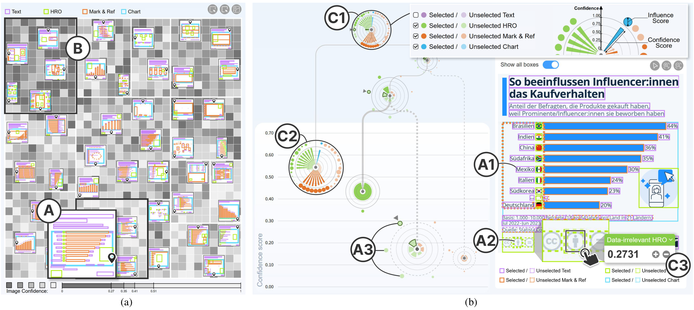

Interactive Target Element Selection in Infographics via Scene Tree Modeling

Codes for the method and system described in our paper [Interactive Target Element Selection in Infographics via Scene Tree Modeling](https://xxxx).

System Startup (Fig. 9)
----------
👉 **The command below helps replicate Fig. 9 by launching the EleDetective visualization system shown in the paper.**



From the repository root, run on Ubuntu 22.04 or newer (x86_64; no GPU required):

```bash
bash run_demo.sh
```

The launcher installs dependencies, downloads the prepared 10,000-image dataset (5.91 GiB; 19.02 GiB extracted), and starts the full system, including correction propagation.

Open [http://localhost:5180](http://localhost:5180) in your browser. For a remote machine, forward port **5180** through your editor (e.g., Cursor). Press `Ctrl+C` to stop the system.

Note
----------
Tested on python 3.8.

This method is best used in a Windows or Mac environment; otherwise, the parallelism of QAP solver may not lead to efficiency improvements, resulting in longer runtime.

Treemap-Based Gridlayout
----------
Please come to [Treemap-Based Gridlayout](./Treemap-Based%20Gridlayout), and follow the README.md in subfolders to setup and run the code.

Visualization System
----------
Please come to [Visualization System](./Visualization%20System), and follow the README.md in subfolders to setup and run the code.